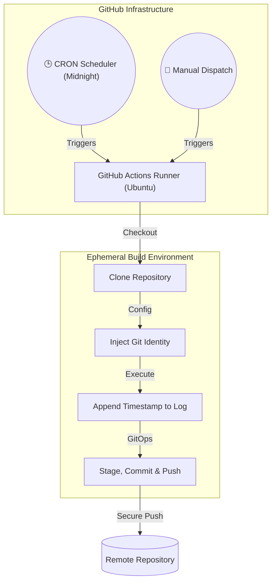

  
  
  
  
  
   
   
  <h2>⚙️ Workflow Automation Engine</h2>
  
<b>Serverless CI/CD Pipeline & Cron-Based Orchestration</b>

  
<i>(Originally developed for the Tools in Data Science course at IIT Madras)</i>

 

This repository contains a streamlined, headless **GitHub Actions** orchestration pipeline. Built to execute entirely in the cloud without manual intervention, it demonstrates core **DevOps and CI/CD competencies** by automating version control operations via CRON scheduling.

While simple in its current implementation, this repository serves as a foundational blueprint for automated systems—a critical skill for AI/GenAI Engineering, where automated model retraining, nightly builds, and scheduled data ingestion pipelines are paramount.

---

## 🌟 Technical Highlights

### 1. Serverless CRON Orchestration
- Utilizes GitHub Actions' `schedule` event to trigger workflows autonomously at midnight (`0 0 * * *`) UTC.
- Completely serverless execution leveraging `ubuntu-latest` runners, requiring zero local infrastructure.

### 2. Headless Version Control (GitOps)
- Programmatically configures Git identity (`user.name`, `user.email`) within the ephemeral runner environment.
- Safely modifies state, stages artifacts, and pushes commits (`Automation by Ghazi-R3`) back to the origin using securely injected environment tokens (`GH_TOKEN`).

### 3. Modular CI/CD Extensibility
- Includes `workflow_dispatch`, allowing on-demand manual triggers of the pipeline outside of the scheduled CRON windows.
- The pipeline (`daily_commit.yml`) is structured immutably in YAML, making it easily extensible for more complex operations (e.g., triggering LLM batch inferences, scraping daily datasets, or running end-to-end tests).

---

## 🏗️ Pipeline Architecture

---

## 🚀 Usage & Deployment

### 1. Setup
To use this automation framework in your own repository:
1. Fork or clone this repository.
2. Ensure you have a GitHub Personal Access Token (PAT) with `repo` scopes.
3. Add the token to your repository secrets as `GH_TOKEN`.

### 2. Configuration
Modify `.github/workflows/daily_commit.yml` to adjust the CRON schedule or extend the bash execution block with custom scripts (e.g., Python scraping scripts, model evaluation runs).

---

## 💼 Why This Matters (For Tech Leadership)

As an AI/GenAI Engineer, the ability to build and deploy ML models is only half the equation. The other half is **MLOps and CI/CD**. 

This repository demonstrates the ability to step outside of Jupyter notebooks and interact with production engineering tools. Understanding how to orchestrate automated, scheduled tasks in CI/CD environments is directly transferable to building resilient AI pipelines, continuous model evaluation loops, and automated deployment architectures.
